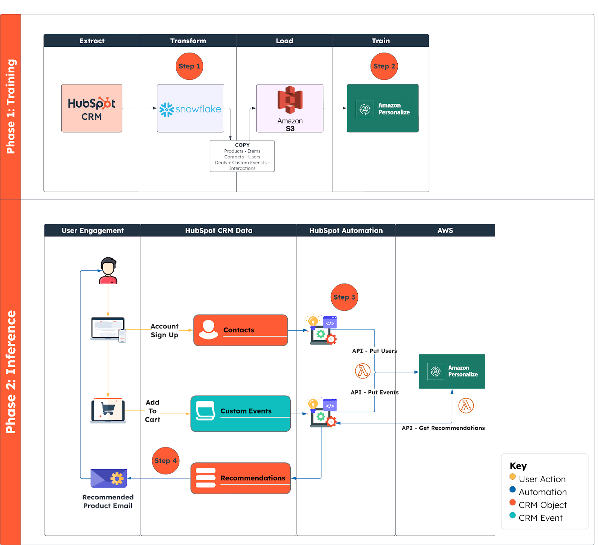
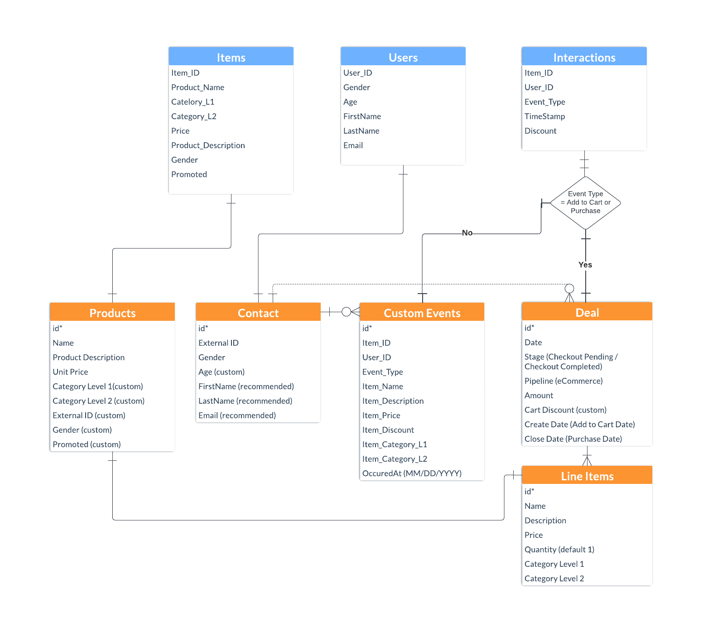

Links to alert messages:
<a href="#gdcalert1">alert1</a>
<a href="#gdcalert2">alert2</a>
<a href="#gdcalert3">alert3</a>
<a href="#gdcalert4">alert4</a>
<a href="#gdcalert5">alert5</a>
<a href="#gdcalert6">alert6</a>
<a href="#gdcalert7">alert7</a>
<a href="#gdcalert8">alert8</a>
<a href="#gdcalert9">alert9</a>
<a href="#gdcalert10">alert10</a>
<a href="#gdcalert11">alert11</a>
<a href="#gdcalert12">alert12</a>
<a href="#gdcalert13">alert13</a>
<a href="#gdcalert14">alert14</a>
<a href="#gdcalert15">alert15</a>
<a href="#gdcalert16">alert16</a>
<a href="#gdcalert17">alert17</a>
<a href="#gdcalert18">alert18</a>
<a href="#gdcalert19">alert19</a>
<a href="#gdcalert20">alert20</a>
<a href="#gdcalert21">alert21</a>
<a href="#gdcalert22">alert22</a>
<a href="#gdcalert23">alert23</a>
<a href="#gdcalert24">alert24</a>
<a href="#gdcalert25">alert25</a>
<a href="#gdcalert26">alert26</a>
<a href="#gdcalert27">alert27</a>
<a href="#gdcalert28">alert28</a>
<a href="#gdcalert29">alert29</a>
<a href="#gdcalert30">alert30</a>
<a href="#gdcalert31">alert31</a>
<a href="#gdcalert32">alert32</a>
<a href="#gdcalert33">alert33</a>
<a href="#gdcalert34">alert34</a>
<a href="#gdcalert35">alert35</a>

>>>>> PLEASE check and correct alert issues and delete this message and the inline alerts.

# Project #1: Custom eCommerce Recommendation Engine with HubSpot and AWS Personalize

Unlock the power of personalized marketing and sales experiences with our step-by-step guide on integrating HubSpot’s smart CRM and AWS Personalize.

## Context and Business Value Overview

In today's competitive eCommerce landscape, offering personalized product recommendations can significantly enhance the customer experience and drive increased sales. By delivering personalized shopping journeys that are tailored to individual user behavior, businesses can increase engagement, conversion rates, and customer loyalty. 

This guide is designed for HubSpot prospects or customers that want to create personalized product recommendations for their own prospects and customers. This document is designed as a tutorial to create a working proof-of-concept that creates recommendations in HubSpot CRM that are accessible by CRM users (i.e. Sales representatives) and are also used in automated email campaigns. Additionally, the architecture used can be adapted for other AI/ML powered personalization use cases where HubSpot’s natively developed AI features might not fit the needed use cases of an Enterprise HubSpot client.

This solution deploys an AI/ML powered recommendation engine leveraging HubSpot's smart CRM capabilities to AWS Personalize to create a robust product recommendation engine. The solution architecture attempts to balance scalability with ease of deployment. Deploying this solution will require a configuration in both AWS and HubSpot. This article will detail the likely needed customizations based on the standard HubSpot CRM implementation, but there are multiple valid architectures, discussed at the conclusion of the article.

### Prerequisites

* Access to HubSpot CRM with admin permissions for Marketing Hub Enterprise, Sales or Service Hub Enterprise and Operations Hub Enterprise
    * This tutorial can be run in a HubSpot sandbox environment or production account
* Access to AWS accounts with appropriate permissions. Services used include:
    * AWS Personalize
    * Amazon S3
    * AWS API Gateway
    * AWS Lambda
* Access to Snowflake to use HubSpot’s Operations Hub Enterprise DataShare data* (Future use can use S3 dump) 

### Cost considerations

By investing in this solution, companies can expect greater engagement with marketing, leading to higher conversion rates and increased revenue. Deploying this solution will require the following costs:

* AWS usage fees
    * Personalize model training and inference | [AWS Personalize Cost calculator](https://calculator.aws/#/createCalculator/personalize)
    * The key variable determining cost is the hours per month that the recommender is active. Recommenders can be started and stopped manually or programmatically. [Learn more in the AWS Personalize documentation](https://docs.aws.amazon.com/personalize/latest/dg/stopping-starting-recommender.html)
* HubSpot subscription costs
    * This solution leverages HubSpot Operations Hub Enterprise and Sales Hub Enterprise
* Development expenses 

### Solution Overview 

To create personalized recommendations in HubSpot that can be leveraged by sales representatives and for marketing automation campaigns, we’ll follow 2 phases, broken into 4 high level steps:  Prepare, Train, Create Recommendations, Use Recommendations

1. Training Phase - train our recommendation engine
    1. Prepare Data Model in HubSpot and Connect to Snowflake for data ETL
    2. Train AWS Personalize eCommerce Recommender from HubSpot data loaded into AWS S3
    3. Create APIs to get recommendations and load new users and item interactions
2. Inference Phase - generate and use recommendations
    4. Create HubSpot assets and then generate recommendations to HubSpot
    5. Use recommendations in a HubSpot custom CRM card and in automated email

**Figure 1:** HubSpot eCommerce Recommendation Architecture Overview

## 1. Training Phase: Prepare Data Model in HubSpot and Connect to Snowflake for data ET

### Data Preparation Overview

The foundation of a successful recommendation engine lies in the quality of data preparation. To facilitate data export and integration with AWS Personalize, HubSpot's Snowflake Data Share is employed. This Data Share allows for the seamless transfer of structured interaction data from HubSpot with minimally required usage of the HubSpot REST API to get training data, quickening development time while ensuring that the recommendation engine has access to up-to-date user behavior for more accurate personalization.

To prepare data, we’ll take 2 high level actions:

1. Prepare data model in HubSpot & import sample data
2. Run ETL by connecting HubSpot Operations Hub Enterprise Snowflake Data Share and export into AWS S3

To successfully deploy an eCommerce Recommender with AWS Personalize, we need data represented as:

* Items - the products sold in the eCommerce store
* Users - the visitors and customers to the eCommerce store
* Interactions - individual actions taken by customer i.e “View”, “Add to Cart”, “Purchase”

For this solution tutorial, we’ve chosen to model the HubSpot data in a blended model:

* Items = HubSpot Products (CRM Object)
* Users = HubSpot Contacts (CRM Object)
* Interactions = HubSpot Custom Event (View + Add to Cart) and Deals (CRM Object where stage “Closed Won” = purchased item)

**Figure 2:** Data Model that maps HubSpot Objects + Events to AWS Personalize Data

### Tutorial Actions:

#### 1.1 To prepare your data in HubSpot:

1. Download Sample Data or Use your own example data
2. Log-in to a HubSpot portal where you have admin access
3. Reference Knowledge Base articles to implement data model
    1. [Create & Edit Properties](https://knowledge.hubspot.com/properties/create-and-edit-properties)
    2. Custom Events
        1. [Import Events](https://knowledge.hubspot.com/reports/create-custom-behavioral-events-with-the-code-wizard#import-event-data)
        2. [Create Events](https://knowledge.hubspot.com/reports/create-custom-behavioral-events-with-the-code-wizard#create-events-with-a-javascript-code-snippet)
    3. [Import Data](https://knowledge.hubspot.com/import-and-export/set-up-your-import-file) in HubSpot
4. Create Product properties
   1. Add Single-Line Text properties to store the following data
   2. Category Level 1
   3. Category Level 2
   4. External ID
   5. Gender
   6. Promoted
5. Create Contact properties
    1. Add Single-Line Text property to store the following data
        1. External ID
    2. Add Number property to store the following data
        1. Age
6. Create Custom Event & Custom Event Properties
    1. Import Events - it is recommended to import one or more rows of sample data to set up your Custom Event. See Import Event Completions step #10.
    2. Create Event Completions - behavioral interactions such as Page Views, Add To Cart can be logged to the Custom Event via Javascript
        1.  Use the Custom Event internal name as created with Import (example: pe23826378_e_commerce_interactions)
        2.  Use Javascript to add event completions from your web application (example below)
            1. 

>>>>>  gd2md-html alert: inline image link here (to images/image3.png). Store image on your image server and adjust path/filename/extension if necessary.  (<a href="#">Back to top</a>)(<a href="#gdcalert4">Next alert</a>) >>>>> 

            2. Provide as much information especially the Event_Type and Item_ID
7. Create Deal properties
    9. Add Single-Line Text property to store the following data
        12. Cart Discount
8. Import Products
    10. Prepare your Products CSV/XLS import file as demonstrated in the Data Model
    11. Go to Products and select Import
        13. Import file from computer
        14. Select “One file”
        15. Select “One object”
        16. Select “Products”
        17. Chose the CSV/XLS file
        18. Select Create new Products Only
        19. Map Columns from CSV to HubSpot Products
            3. Item_ID → External_ID
            4. Product_Name → Name
            5. Category_L1 → Category_Level_1
            6. Category_L2 → Category_Level_2
            7. Price → Price
            8. Product_Description → Description
            9. Gender → Gender
            10. Promoted → Promoted
            11. [Optional] - Folder Name → &lt;a folder where all products should be grouped by>
        20. Complete Import of Products
9. Import Contacts
    12. Prepare your Users CSV/XLS import file as demonstrated in the Data Model
        21. Recommended to include First & Last Name and Email
    13. Go to Contacts and select Import
        22. Import file from computer
        23. Select “One file”
        24. Select “One object”
        25. Select “Contacts”
        26. Chose the CSV/XLS file
        27. Select Create new Contacts Only
        28. Map Columns from CSV to HubSpot Contacts
            12. User_ID → External_ID
            13. Gender → Gender
            14. Age → Age
            15. FirstName → First_Name
            16. LastName → Last_Name
            17. Email → Email
        29. Complete Import of Contacts
10. Import Event Completions
    14. Prepare your Interactions CSV/XLS file with Product metadata based on unique ItemID and Contact ID based on unique User_ID
    15. Import Events - to import Custom Event Completions a Custom Event must be created.
        30. Using the [Import Events](https://knowledge.hubspot.com/reports/create-custom-behavioral-events-with-the-code-wizard#import-event-data) Knowledge Base article import a CSV
            18. Details
                1. Event Name = E-Commerce Interactions
                2. Description = E-Commerce Interactions
                3. Associated Object = Contacts
            19. Upload
                4. Select Import File
                5. Create and Update Contacts
                6. Create new Custom event completions only
        31. Create & Map relevant String properties to support the interactions
            20. Import As Custom Event properties
                7. Event_Type
                8. Item_ID
                9. Item_Name
                10. Item_Description
                11. Item_Category_L1
                12. Item_Category_L2
                13. Item_Price
                14. Item_Discount
                15. User_ID
                16. Timestamp = map to OccurredAt
            21. Import as Contact properties
                17. Map to Record ID
        32. Complete Event Import
11. Import Deals for “Added to Cart” items
    16. Export Products - this is needed to get the HubSpot Product ID
        33. Include Item_ID
    17. Export Contacts - this is needed to get the HubSpot Contact ID
        34. Include External_ID
    18. Prepare your Deal with relevant data points
        35. Pipeline - eCommerce
        36. Stage - for Add To Cart use Checkout Pending
    19. Prepare your Interactions file to include metadata for Deal, Line Items and Contact association. Include the following columns in your Interactions file for Deals. Additionally, only include rows that have Event_Type = Added to Cart
        37. Contact ID - match CSV/XLS column based on User_ID
        38. Product ID - match CSV/XLS column based on Item_ID
        39. Deal Name - recommended to include Product Name + other naming lookup (example: Stylish Cool Earrings Cart)
        40. Deal Pipeline - eCommerce
        41. Deal Stage - Checkout Pending
        42. Quantity - 1
        43. Deal Amount - Item_Price
    20. Go to Deals and select Import
        44. Import file from computer
        45. Select “One file”
        46. Select “Multiple object”
        47. Select “Deals”, “Line Items”, “Contacts”
        48. Chose the CSV/XLS file
        49. Select Create new Line Items Only
        50. Select Update existing Contacts Only
        51. Create new Deals Only
        52. Map Columns from CSV to HubSpot Deals
            22. Discount → Deal Properties → Cart Discount
            23. Item_Category_L1 → Line Item Properties → Category_Level_1
            24. Item_Category_L2 → Line Item Properties → Category_Level_2
            25. Item_Price → Line Item Properties → Unit Price
            26. Item_Name → Line Item Properties → Name
            27. Item_Description → Line Item Properties → Description
            28. Contact_ID → Contact Properties → Record ID
            29. OccurredAt → Deal Properties → Create Date
            30. Product_ID → Line Item Properties → Product ID
            31. Deal Name → Deal Properties → Deal Name
            32. Deal Pipeline → Deal Properties → Pipeline
            33. Deal Stage → Deal Properties → Deal Stage
            34. Quantity → Line Item Properties → Quantity
            35. OccurredAt → Deal Properties → Create Date
            36. Deal Amount → Deal Properties → Amount
        53. Complete Import of Deals
12. Import updated Deals with Purchase data
    21. Export Deals - this is needed to get the HubSpot Deal ID. Export Deals from HubSpot which were uploaded as Added To Cart.
    22. Prepare your Interactions file to include metadata for Deal. Include the following columns in your Interactions file for Deals. Additionally, only include rows that have Event_Type = Purchased
        54. Deal ID - this is needed to update the Deals which are in Stage = Checkout Pending to update to Checkout Completed. Match the HubSpot Deal ID with Purchase Row based on Contact ID and Item ID and Event Type = Purchase
        55. Deal Stage - Checkout Completed
    23. Go to Deals and select Import
        56. Import file from computer
        57. Select “One file”
        58. Select “One object”
        59. Select “Deals”
        60. Chose the CSV/XLS file
        61. Select Update existing Deals only
        62. Map Columns from CSV to HubSpot Contacts
            37. Deal_ID → Deal Properties → Record ID
            38. OccurredAt → Deal Properties → Close Date
            39. Deal Stage → Deal Properties → Deal Stage
        63. Complete Import of Deals

>>>>>  gd2md-html alert: inline image link here (to images/image4.png). Store image on your image server and adjust path/filename/extension if necessary.  (<a href="#">Back to top</a>)(<a href="#gdcalert5">Next alert</a>) >>>>> 

Figure 3: Data preparation flow to stage training data in HubSpot that can be exported through Snowflake and into AWS

Note: In a production environment, you likely have access to much of this data already and the data preparation 

#### 1.2 ETL Training Data from HubSpot to Snowflake to S3

[HubSpot Operations Hub Enterprise](https://www.hubspot.com/products/operations/snowflake-data) allows easy access to the entire HubSpot data model via the Snowflake Data Share, easing development efforts in extracting and loading data from HubSpot. While extracting CRM object data from HubSpot via REST APIs is widely available, Operations Hub Enterprise is recommended due to the ability to query and join user event interaction data (i.e. Add to Cart, modeled as a HubSpot custom event) with purchase data (modeled as HubSpot Deals object). Bulk extraction of HubSpot custom event data is not widely available via the HubSpot REST API. 

##### Configure Snowflake

1. [Enable Operations Hub Enterprise Snowflake Data Share](https://knowledge.hubspot.com/reports/connect-snowflake-data-share)
    1. Note: If your HubSpot Account does not have Operations Hub Enterprise, connect with your HubSpot Customer Success Manager, Account Executive, or [enable a trial](https://www.hubspot.com/products/operations). Alternatively, [schedule time with a Solution Architect](https://hubspot.com/meetings/rainslie1/solution-architect-round-robin) to explore this solution
2. Create test queries
    2. Modify queries for your particular data warehouse and HubSpot portal
3. [Configure Snowflake to unload data to S3](https://docs.snowflake.com/en/user-guide/data-unload-s3)
    3. Snowflake allows multiple methods to connect to AWS
        1. Create IAM user
        2. In IAM user, navigate to Security Credentials > Create new Access Key. Copy the Access Key ID and Secret Key (treat these keys safely!)
        3. Add a permission policy to the user that grants access to S3 - this can be done using an AWS managed S3FullAccess policy, or by creating a new policy that grants access to specific S3 buckets
            1. Link to IAM User Policy
4. In a future step, you will run queries from Snowflake to extract data to S3.

##### Launch the Personalize MLOps stack

5. From the AWS Solution: [Maintaining Personalized Experiences with Machine Learning](https://aws.amazon.com/solutions/implementations/maintaining-personalized-experiences-with-ml/) follow [this step](https://docs.aws.amazon.com/solutions/latest/maintaining-personalized-experiences-with-ml/step-1.-launch-the-stack.html) to automatically create the stack using AWS CloudFormation.
    4.  Give the stack a unique name like “hubspot--personalize-mlops-stack”. 
        4. Note: It is recommended that you also provide a valid email address for the optional input parameter so you can receive MLOps notifications.
    5. The stack takes a few minutes to create. Once it shows CREATE_COMPLETE, click the stack outputs and take note of the CloudWatch Dashboard and PersonalizeBucketName

##### Upload Personalize Dataset(s)

6. Once your stack is created, upload sample customer datasets and schemas to the Personalize Bucket. 
    6. The stack expects data files in CSV format, and a Personalize configuration file in JSON that defines the customer's dataset schema. For instance, this sample dataset group contains CSV files for interactions, items, and users while the json file contains the data schema, event tracker, and e-Commerce recommender configuration
    7. Update the Snowflake queries (link to queries) to point to the new S3 bucket \
**s3://&lt;personalize_bucket_name>/train/{file_name.csv}/**
7. Upload Personalize config to S3
    8. [Download Personalize](https://203693.fs1.hubspotusercontent-na1.net/hubfs/203693/config.json) config and then upload to the S3 bucket created by the Stack
    9. This will train the model using the provided datasets and can take a few hours to complete. The status can be checked by navigating to the Personalize Data Set UI in the AWS Console

##### Create Personalize APIs 

To enable programmatic interaction with the Personalize Recommenders, we will launch a set of APIs leveraging AWS API Gateway and AWS Lambda. These APIs will be utilized in a future step via HubSpot automated Workflows. 

1. Launch the Real-Time API [CloudFormation stack](https://github.com/aws-samples/personalization-apis/blob/main/README.md#option-1-install-using-cloudformation-single-click-easiest)
2. Once completed, 

## 2. Inference Phase: Generating & Using Recommendations in HubSpot to Drive Sales

Once the AWS Personalize model is operational, generating and using recommendations within HubSpot can commence. The 'Generating Recommendations' process includes adding new item interactions and users to the system, and then obtaining personalized suggestions for each user. These recommendations can then be utilized in two key ways within HubSpot:

1. By automating emails that include personalized product recommendations 
2. By creating a custom CRM card UI extension within the smart CRM, allowing for manual generation and viewing of recommendations. 

This integration not only enhances the user experience but also equips sales and marketing teams with powerful tools to engage and convert customers.

This tutorial will walk you through the following:

1. Creation of a HubSpot Marketing Email with programmable email module for recommendation records
2. Creation of Workflows that interact with AWS Real Time Personalize APIs
    1. Send new user from HubSpot to AWS Personalize
    2. Send event interactions (i.e. Product Add to Cart) from website to HubSpot to AWS Personalize
    3. Trigger send of email 
3. Creation of a custom CRM card that shows recommendations and allows interaction of refreshing recommendation records manually and attaching recommendations to a Deal as Line Items.

#### Tutorial Actions

##### Creation of HubSpot Assets and Automations

###### Marketing Email - Use HubSpot Marketing Programmable Emails to send Product Recommendations from a Custom Object. 

Resources

* [Create Marketing Emails](https://knowledge.hubspot.com/marketing-email/create-marketing-emails-in-the-drag-and-drop-email-editor)
* [Programmable Emails](https://knowledge.hubspot.com/marketing-email/create-programmable-emails)
1. Dynamic Programmable Module
    1. Under Marketing or Content go to the Design Manager and create a new file of Type = Module. Set the Module usage on Emails and Content Scope = Local.
    2. Turn on the setting for “Use module for programmable email”
    3. Add the following fields to be used within your module
        1. 

>>>>>  gd2md-html alert: inline image link here (to images/image5.png). Store image on your image server and adjust path/filename/extension if necessary.  (<a href="#">Back to top</a>)(<a href="#gdcalert6">Next alert</a>) >>>>> 

    4. Code - copy code from GitHub and paste in the code section. 
    5. Save and Publish the module
2. Product Recommendations Email
    6. Create a new Marketing Email with Type = Automated Email
    7. Select the appropriate Template for your Marketing Email
    8. Add relevant marketing content around Product Recommendations including personalization from the Contact Object.
    9. Add the Programmable Module to the Email
    10. Set up the Settings such as Subscription Type, Subject Line, Campaign
    11. Save and Publish the Email
3. Workflow Automation - use the Marketing Email in your Workflow Automation

###### Custom Events

A use case for Custom Events are to track interactions that occur for any web application such as e-commerce, mobile, SaaS platforms. To leverage the AWS Personalize for Product Recommendations we use Custom Events to track events such as Page Views, Add to Cart or Checkout clicks, Searches.

1. [HubSpot Tracking Code](https://knowledge.hubspot.com/reports/install-the-hubspot-tracking-code) - allow HubSpot to monitor your website traffic
2. [Tracking Code API](https://developers.hubspot.com/docs/api/events/tracking-code) - use the HubSpot API to identify visitors, track events and manually track page views
3. [Custom Events](https://knowledge.hubspot.com/reports/create-custom-behavioral-events-with-the-code-wizard#create-events-with-a-javascript-code-snippet) - use JavaScript to track specific events that map to customer behavioral actions such as Add to Cart or Checkout
    1. Create or use an existing Custom Event which tracks e-commerce interactions
    2. Add Javascript to track Add to Cart clicks 
    3. Code - copy code from GitHub and use it on your web application on Add to Cart button click. 

###### Workflow Automation

HubSpot Workflows have been leveraged to send CRM data to AWS Personalize on a real-time basis. [Programmable Automation via Operations Hub Professional](https://www.hubspot.com/products/operations/programmable-automation) is used to establish an integration between HubSpot and AWS Personalize. The 3 workflows listed below send User/Contact, Customer Interactions & Purchase data from HubSpot to AWS Personalize through AWS Lambda Functions. Recommendations from AWS Personalize are retrieved and stored within a HubSpot Custom Object.

Resources

* [Workflows](https://knowledge.hubspot.com/workflows/create-workflows) & [Event based Enrollments](https://knowledge.hubspot.com/workflows/set-event-enrollment-triggers)
* [Custom Coded Actions](https://developers.hubspot.com/docs/api/workflows/custom-code-actions)
    * Node.js 20.x or higher
    * Axios Library
    * Secrets
        * HubSpot Private App Token
        * AWS Lambda Authentication API Key
    * Code - common constants/variables utilized
        * Token - this is the HubSpot Private App Token. Secret Name (used) = Token
        * URL - provide the AWS Lambda Function URL to create/update Users, create Interactions, get Recommendations from AWS Personalize
        * X-API-Key - provide the AWS Lambda Authentication Key. Secret Name (used) = Personalize_Key
        * Tracking ID - use [AWS Personalize Event Tracker](https://docs.aws.amazon.com/personalize/latest/dg/API_CreateEventTracker.html) to log Interactions
        * Custom Event Internal ID
* AWS Lambda Functions
1. **HubSpot Contact Creation** → Put Users in AWS Personalize - send Contact information to AWS Personalize
    1. Create a Contact based Workflow with event driven trigger = Object Created. Optional - add additional filters if needed to send specific Contacts
    2. Enroll Contact to receive Marketing Emails via the [Manage Communication Subscription](https://knowledge.hubspot.com/records/manage-your-subscription-preferences-and-types#:~:text=Update%20the%20subscription%20status%20of%20contacts%20with%20a%20workflow) Action
    3. Create a Custom Coded Action that uses the AWS Lambda Authentication Key to send Contact data to AWS Personalize API Endpoint (PutUsers)
        1. Properties - include Contact properties to send to AWS Personalize
            1. Age
            2. Gender
        2. Code - copy code from GitHub and paste in the code section. 
    4. [Optional] - copy the response from AWS Personalize in a Contact Multi-Line Text Custom Property.
    5. Copy the HubSpot Contact Record ID to a custom single-line text property “External ID” via the [Copy Property Value Action](https://knowledge.hubspot.com/workflows/compatible-source-and-target-properties-for-copying-property-values-in-workflows) step
2. **HubSpot Deal Checkout Completed** → Put Events in AWS Personalize - send the purchase data as Interactions to AWS Personalize
    6. Create a Deal based Workflow with event driven trigger = Property Value Changed. Optional - add additional filters if needed to send specific Deals.
        3. Set Property Value = Deal Stage is any of Checkout Completed for a specific Deal Pipeline
    7. Create a Custom Coded Action that gets the purchase data from the Deal including the Product Line Items and build the request body standardized to create Interactions Events in AWS Personalize
        4. Code - copy code from GitHub and paste in the code section.
        5. Create a Data Output String Property = CompleteEventObject
    8. Create a Custom Coded Action that will send the standardized JSON request body to AWS Personalize API Endpoint (PutEvents)
        6. Use CompleteEventObject as a Property Input = CompletionEvent
        7. Code - copy code from GitHub and paste in the code section.
    9. [Optional] - copy the response from AWS Personalize in a Deal Multi-Line Text Custom Property.
3. **HubSpot Custom Event Completed** → Put Events in AWS Personalize - send the customer’s event data as Interactions to AWS Personalize
    10. Create a Contact based Workflow with event driven trigger = Completed a Custom Event. Optional - add additional filters if needed to send specific Contacts.
    11. Create a Custom Coded Action that gets the events data from Custom Events and build the request body standardized to create Interactions Events in AWS Personalize
        8. Code - copy code from GitHub and paste in the code section.
        9. Create a Data Output String Property = CompleteEventObject
    12. Create a Custom Coded Action that will send the standardized JSON request body to AWS Personalize API Endpoint (PutEvents)
        10. Use CompleteEventObject as a Property Input = CompletionEvent
        11. Code - copy code from GitHub and paste in the code section.
    13. [Optional] - copy the response from AWS Personalize in a Deal Multi-Line Text Custom Property.
    14. Add a Delay Workflow Action Step for 1 minute
    15. Create a Custom Coded Action that gets the Recommendations from AWS Personalize through AWS Lambda Function
        12. Code - copy code from GitHub and paste in the code section.
        13. Create a Data Output String Property = AWSPersonalizeRecommendations
    16. Create a Custom Coded Action that parses through the AWS Personalize Recommendations response and gets the HubSpot Product Metadata
        14. Code - copy code from GitHub and paste in the code section.
        15. Create a Data Output String Property = ProductInfo
    17. Create a Custom Coded Action that parses through the ProductInfo from the previous step and creates Recommendations in the Product Recommendation Custom Object
        16. Use ProductInfo as a Property Input = ProductInfo
        17. Code - copy code from GitHub and paste in the code section.
    18. Add a Delay Workflow Action Step for 1 minute
    19. Use the Send Email Workflow Action Step to send the Product Recommendations Email for the Enrolled Contact

##### CRM Card Configuration

CRM customization is a cornerstone of an efficient sales process. Reps need to see and action information in the right place, at the right time. In the case of a B2B sales company utilizing eCommerce, some sales will happen touchlessly (and be addressed by automation), while higher value customers will require direct rep interaction.

The personalization engine generated here can be accessed and actioned by reps reps via customizing the CRM. HubSpot provides UI extensions - essentially micro-apps, hosted on HubSpot, with a React frontend and Node.js backend. With these tools, we can construct a full view of product recommendations for individual contacts and take actions on those, such as opening a deal and sending a product recommendation with one click:

>>>>>  gd2md-html alert: inline image link here (to images/image6.png). Store image on your image server and adjust path/filename/extension if necessary.  (<a href="#">Back to top</a>)(<a href="#gdcalert7">Next alert</a>) >>>>> 

## Deployment
Detailed steps on deploying this solution, including code snippets and configuration settings, can be found in the respective folders and files of this repository.

## Contributing
Contributions to improve the solution are welcome. Please fork the repository, make your changes, and submit a pull request.

## Support
For support, feature requests, or bug reporting, please open an issue in this repository.

## License
[Specify the license under which this project is released]

## Contact Information
For further assistance or queries, please contact [Your Contact Information].

Thank you for choosing to enhance your eCommerce strategy with our personalized recommendation engine guide!

